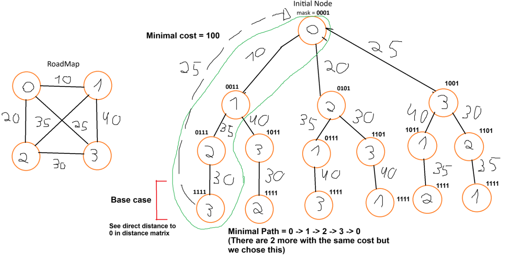

---
header-includes:
  - \usepackage{listings}
  - \usepackage{xcolor}
  - \lstset{
      basicstyle=\ttfamily\small,
      breaklines=true,
      commentstyle=\color{gray},
      morecomment=[l]--,
      escapeinside={(*@}{@*)}
    }
---

# PFL PROJECT GRAPH ALGORITHMS

## PROJECT MEMBERS

- Bruno Miguel Gonçalves Ferreira | up202207863@edu.fe.up.pt
- Pedro Miguel Silva Roleira Marinho | up202206854@edu.fe.up.pt

## PARTICIPATION

- Each one of us did **50%** of the work asked. The two most difficult algorithms were made by each student and the rest of the functions were divided accordingly.

## SHORTEST PATH

- **Algorithm selection**: On the function `shortestPath` we decided to utilize the Dijkstra algorithm, rather than any other ones, because it's one of the best, having a time complexity of O((V + E) log V) with **V** being the number of nodes(cities) and **E** the number of edges(roads).

- **Algorithm explanation**: Starting of analysing the function `shortestPath` we have 3 different cases that can happen, the start city is equal to the end city, the end city isnt reachable from the start city (we can use a dfs to see that) and finally if the path is possible. If it is indeed possible we compute Dijkstra Algorithm, but before entering a new function's scope we initialize some important values.

\begin{lstlisting}[language=Haskell]
adjList = convertToAdjList graph -- use a new data type type AdjList = [(City, [(City, Distance)])] for easier handling
initialPrio = [(start,0)] -- priorityQueue is represented with type PriorityQueue = [(City,Distance)] 
initialDistances = foldl (\acc city -> (if city == start then (city,0) else (city,100000000)) : acc) [] (cities graph) -- set all distances to infinite, minus the start city 
predecessors = [(start,[])] -- keep track of the optimal paths
visited = [] -- keep track of visited nodes
\end{lstlisting}

Going inside `dijkstra` function we can see that, when we empty our priorityQueue the function ends and returns each node precedessors, so we can later on build the paths. Otherwise, we still have to process all of them. Having this in mind, our loop keeps on extracting the city with the minimal distance from the priorityQueue, adds the city to the visited list and iterates trough all unvisited adjacent nodes.

\begin{lstlisting}[language=Haskell]
min = getMinPrioQueue initialPrioQueue  -- Get the city with the minimum distance (City,Distance)
newPrioQueue = popMinPriorityQueue initialPrioQueue min  -- Remove it from the priority queue
newVisited = visited ++ [fst min]  -- Add the city to the visited list
unvisitedNodes = nodesNotVisited adjList (fst min) visited  -- Get unvisited neighbors of the current city
(newDistances, newPredecessors, updatedPrioQueue) = foldl updateDistances (initialDistances, predecessors, newPrioQueue) unvisitedNodes -- Iterate through the unvisitedNodes applying updateDistances
\end{lstlisting}

Now we need to look at `updateDistances` and see what it's doing. So before "jumping" to our three different cases `LT`,`EQ` and `GT` we store some important values that we will use later. 

\begin{lstlisting}[language=Haskell]
currentDistance = snd min  -- Distance to the current node
newDistance = currentDistance + weight  -- New distance through the current node
existingDistance = lookupDistance neighborCity distances  -- Existing distance to the neighbor
existingPreds = snd (head $ filter ((== neighborCity) . fst) preds)   -- Get existing predecessors for the neighbor                                  
\end{lstlisting}

By comparing the `newDistance` of the city we are processing with the `existingDistance` from the distances list. 
- If the `newDistance < existingDistance` we update the distancesList, store the newBestPredecessorPath to the predecessors list and "decrease the key", replacing from the prioqueue the old (neighboorCity,distance) with (neighboorCity,newDistance) to the priorityQueue.
- If the `newDistance == existingDistance`, meaning there is another path that can have the least cost, we add it to predsList replacing or creating a predecessor, if needed.
- If the  `newDistance > existingDistance` and `existingDistance == INFINITY`,with `INFINITY = 100000000`, we yet again update the distanceList with the neigboorCity and its newDistance, add a new predecessor and insert the new (city,dist) into the priority queue.

After processing `shortestPath gTest5 "1" "3"`  we will get something like this from the dijkstra function: `[("3",["4","2"]),("4",["1"]),("2",["1"]),("1",[])]`

Now we only have to build the path. To do that we use `collectAllPaths` and recursively get all of them.
\begin{lstlisting}
endNode = "3"
startingPath = ["3"]
firstRecursiveCall:  startingPath ++ ["4"]  ------/////------ startingPath ++ ["2"]
secondRecursiveCall: startingPath ++ ["4"] ++ ["1"] ------/////------ startingPath ++ ["2"] ++ ["1"]
thirdRecursiveCall :  startingPath ++ ["4"] ++ ["1"] ++ [] ------/////------ startingPath ++ ["2"] ++ ["1"] ++ [] (stop at empty list)
callBack: We retrieve them in reverse order
\end{lstlisting}

In the end we will get two paths, in this case with the same size, being `[["1","2","3"],["1","4","3"]]`.

## TRAVELSALESMAN

- **Algorithm selection**: On the function `travelSales` we decided to utilize an algorithm that takes advantage of dynamic programming, resorting to bit manipulation and the use of a 2d matrix. In this algorithm, the time complexity is O(n^2 * 2^n) where n is the number of cities.

- **Algorithm explanation**: Our thought process for this function was to use a mask, that represents the cities we have currently visited, and also a 2d matrix that maps the distances between nodes. Having that in mind, we then recusively calculate each paths's cost and return the one with the least amount.

To go more in depth, we initialy setup some important values, such as the `initialMask` and the `2d matrix`, already mentioned above, as well as the `initial position` and the mask of all visited cities.

\begin{lstlisting}[language=Haskell]
adjMatrix = convertToAdjMatrix graph 
initialMask = Data.Bits.bit 0 -- initial mask is 1 meaning we visit the first city
uniqueCities = length (cities graph)
visited = allVisited uniqueCities
initialPos = 0
\end{lstlisting}

Now let us analyse, our recursive function `auxTravelSales`. We reach the base case of this function, when we have already visited all cities. To check that we have finished, we just need to compare `currentMask` with the `visitAll` mask. In case we still haven't reached the end of this function, we compute for each city, while still unvisited, all possible paths with their respective cost. In between recursive calls, we update the path being built, the current position and the bit mask.
In the end, we check which path is less costly and return it.

So as to have a better understading of this algorithm we have drawn a small example for how the cities are being processed.

The image visualizes the process of solving the Traveling Salesman Problem (TSP) using bit masking and dynamic programming. The circles represent the cities, and the paths between them show the possible routes, annotated with their respective distances.

The bit masks next to each node represent the cities visited up to that point in the recursion. For example, the bit mask 0011 means cities 0 and 1 have been visited. The algorithm tracks the visited cities using these masks and recursively explores all possible routes, calculating the cumulative distance.

At the end of each complete path (when the mask becomes 1111, meaning all cities have been visited), the algorithm returns the distance to the start city 0. The minimal path, highlighted in green, has a total cost of 100, which is the shortest path that visits all cities exactly once and returns to the starting point (In this case there are 3 shortest paths but we extract one).